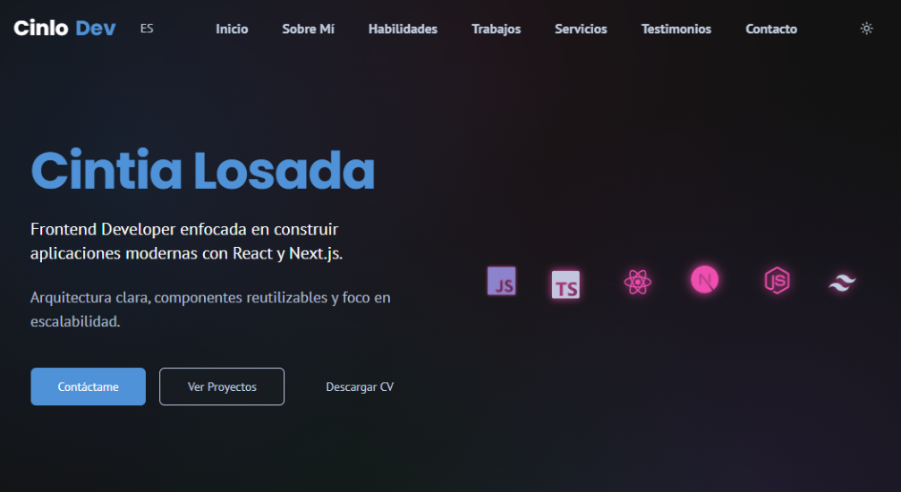

# CinloDev — Web Portfolio

  
  
  
  

  Personal portfolio of <strong>Cintia Losada (Cinlo)</strong>, frontend web developer focused on building modern, responsive and user-centered web applications.

  🌐 <a href="https://www.cinlodev.com" target="_blank" rel="noopener noreferrer">Visit Live Website</a>

---

## Preview

---

## Overview

This portfolio was designed and developed to showcase:

* 💻 frontend development projects
* 🤝 real client work
* 🧩 UI component implementations
* 🧪 ongoing experiments and work-in-progress applications

The goal is to provide a clear view of my development approach, code structure and design decisions.

---

## Features

* 🧱 Component-based architecture using modern React patterns
* 📱 Responsive layouts optimized for multiple devices
* 🌎 Language switcher (Spanish / English)
* 🎨 UI components built with Radix UI and Tailwind
* 📝 Form handling with React Hook Form and Zod
* 🌙 Dark mode support
* ⚡ Performance-focused frontend structure

---

## Projects

The portfolio includes a selection of:

* 🧑‍💻 personal development projects
* 🎛 UI and component experiments
* 🌐 real client websites
* 🛠 applications currently in development

Some client projects are presented as live demos while the source code remains private due to commercial use.

---

## Author

**Cintia Losada (CinloDev)**
Frontend Web Developer

