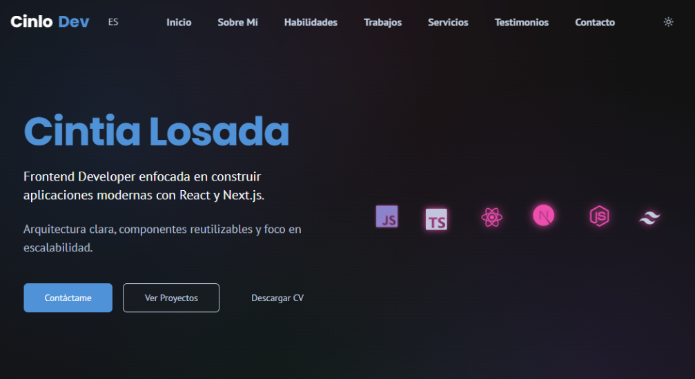

# CinloDev

### Frontend-focused Full Stack Developer
**Building modern SaaS platforms with React, Next.js, TypeScript and scalable architectures.**

  
  
  
  
  
  

  Personal portfolio of <strong>Cintia Losada (Cinlo)</strong>, frontend web developer focused on building modern, responsive and user-centered web applications.

  🌐 <a href="https://portfolio.cinlodev.com" target="_blank" rel="noopener noreferrer">Visit Live Website</a>

---

## Preview

---

## Overview

Professional portfolio bringing together production SaaS platforms, commercial projects, and engineering experiments.

Rather than just displaying static websites, this portfolio showcases an **software ecosystem** consisting of fullstack SaaS products in production, comprehensive architectural showcases, real client implementations, and modern design systems.

---

## 📌 Featured Repositories

Explore the technical documentation and source code behind the ecosystem:

- 💰 **[AlDía Technical Showcase](https://github.com/CinloDev/aldia-showcase)** — Architectural overview, database schema, and product vision for AlDía.
- 🦷 **[CinloLabs Technical Showcase](https://github.com/CinloDev/cinlolabs-showcase)** — Feature-Driven Architecture (FDA), multi-tenant isolation, and ADRs for CinloLabs.
- 🌐 **[Portfolio Source Code](https://github.com/CinloDev/CinloDev)** — Next.js bilingual portfolio application.

---

## 🚀 Featured Projects

### 💰 AlDía
**Personal & collaborative finance SaaS.**

A production-ready SaaS platform designed to centralize everyday financial tracking, budgeting, and shared group expenses.

- **Dashboard:** Interactive financial metrics, monthly budgets, and cash flow projections.
- **Shared Expenses:** Multi-user shared groups with independent balances and automatic debt calculation.
- **Savings Goals:** Real-time visual progress tracking toward personalized financial targets.
- **Credit Cards & Budgets:** Comprehensive payment cycle and category spending management.

🌐 **[Live Demo](https://aldia.cinlodev.com)** · 📚 **[Technical Showcase](https://github.com/CinloDev/aldia-showcase)**

---

### 🦷 CinloLabs
**Multi-tenant B2B SaaS for dental laboratories.**

An end-to-end operational management platform designed to digitize dental laboratory workflows and connect labs with dentist clients.

- **Order Management:** Full lifecycle tracking of prosthetic work orders from intake to delivery.
- **Dentist Portal:** Dedicated client portal for dentists to submit orders and monitor production status in real time.
- **Public Landing Pages:** Built-in multi-tenant website generator with customizable templates and visual theming per lab.
- **Feature-Driven Architecture (FDA):** Decoupled domain architecture (`platform`, `tenant`, `products`, `core`) enforced by CI pipelines.
- **Security & Multi-Tenancy:** Software tenant isolation backed by PostgreSQL Row Level Security (RLS) and RBAC.

🌐 **[Live Demo](https://labs.cinlodev.com)** · 📚 **[Technical Showcase](https://github.com/CinloDev/cinlolabs-showcase)**

---

### 🌐 Commercial & Client Websites
Production websites and interactive educational platforms developed for real clients, prioritizing speed, accessibility, SEO, and polished visual identities.

---

### 🧩 UI Components & Engineering Experiments
Reusable components, custom design systems, micro-animations, and frontend architectural explorations built with React, Radix UI, and Tailwind CSS.

---

## 🛠 Tech Stack
### Technologies commonly used across the projects in this portfolio.

### Frontend
- **React & Next.js** (App Router, Server Components, Server Actions)
- **TypeScript**
- **Tailwind CSS**

### Backend & Data
- **Supabase** (Auth, Storage, Realtime)
- **PostgreSQL**
- **Row Level Security (RLS)**

### Infrastructure & Tooling
- **Vercel**
- **Cloudflare**
- **Resend** (Transactional Emails)

### UI & Design Systems
- **Radix UI & shadcn/ui**
- **Framer Motion**
- **Recharts**

---

## 🏗 Architecture & Engineering Practices

Projects showcased in this portfolio are built using modern engineering practices, including:

- **Feature-Driven Architecture (FDA)** with strict domain boundaries enforced via CI pipelines (`check-boundaries`)
- **Component-driven development** and design token consistency
- **Server Components & Server Actions** for optimal performance and secure data mutations
- **Row Level Security (RLS)** applied directly at the PostgreSQL layer
- **Role-Based Access Control (RBAC)** and comprehensive audit logging
- **Multi-tenant architecture** with complete data isolation
- **Responsive-first & Mobile-first design** tailored for complex desktop and mobile workflows

---

## Author

**Cintia Losada (CinloDev)**  
*Frontend-focused Full Stack Developer*  
🌐 [portfolio.cinlodev.com](https://portfolio.cinlodev.com)

## 📄 License

This repository is released under the MIT License.