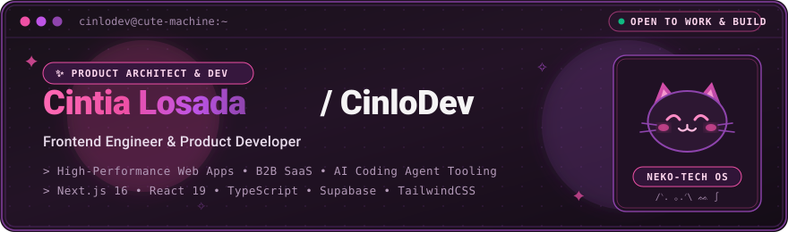
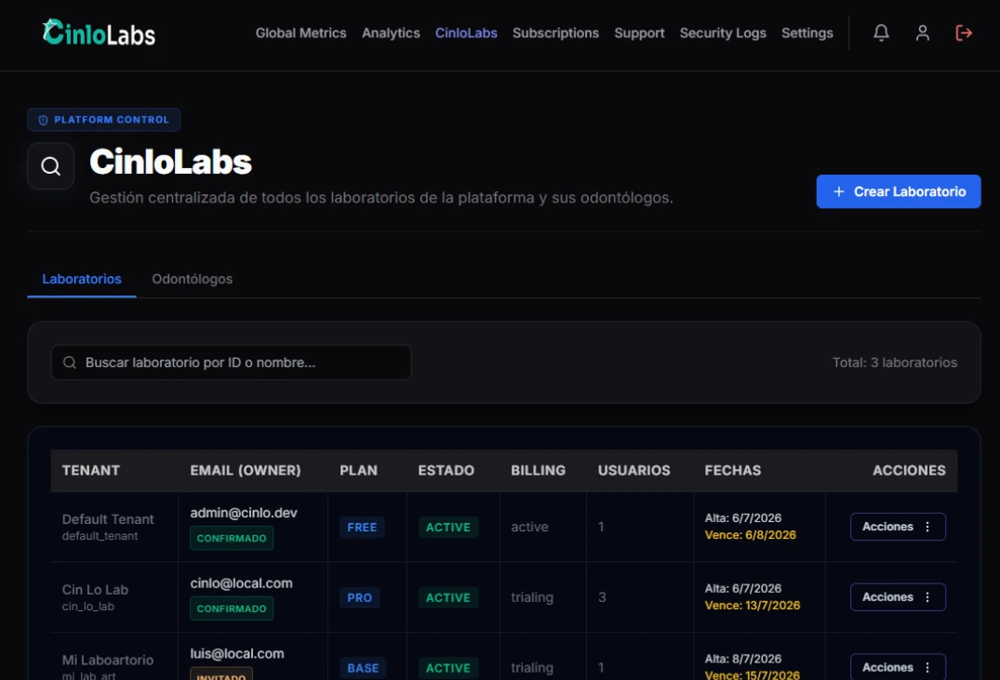
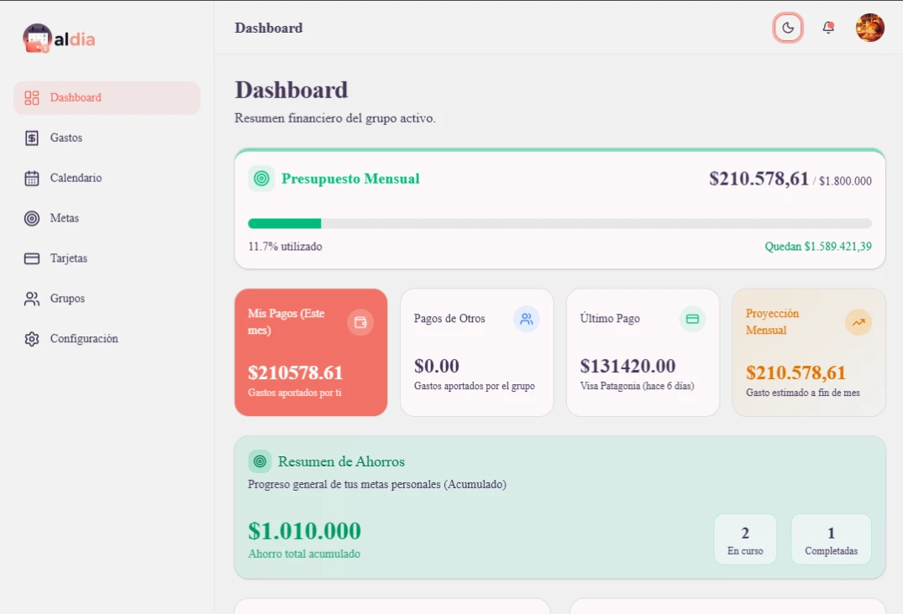
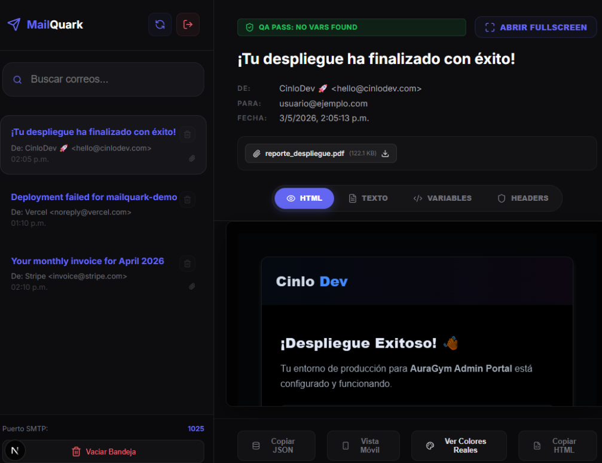
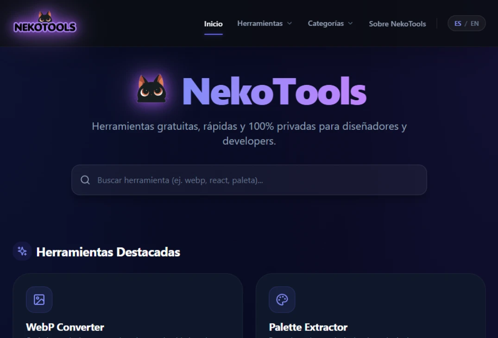
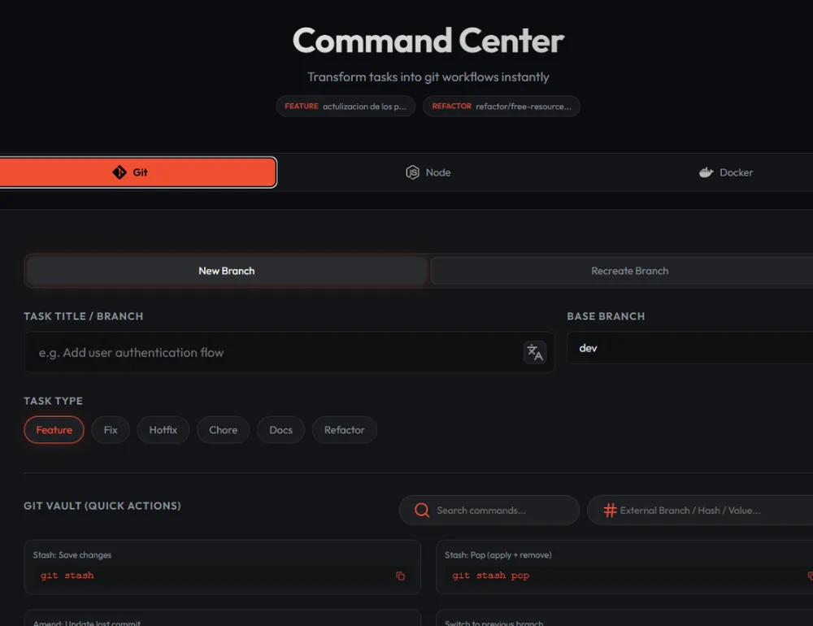
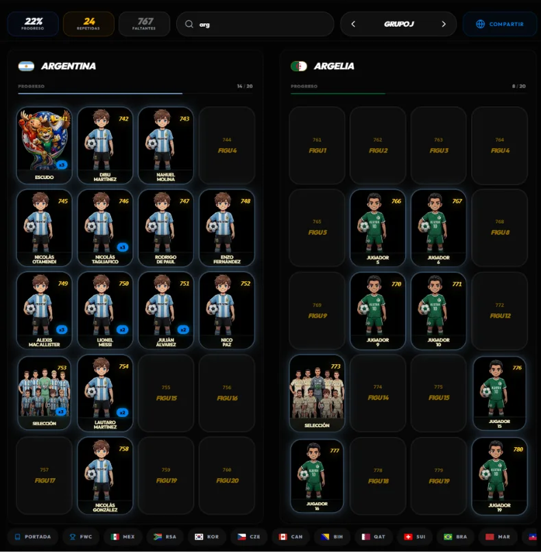

  

  

  
  
  
  
  

---

### /ᐠ. ｡.ᐟ\ Hey there! I'm Cintia Losada (CinloDev)

**Frontend Engineer, SaaS Product Builder & AI Coding Agent Toolmaker**

I specialize in crafting high-performance web applications, multi-tenant B2B SaaS platforms in production, and developer tooling. My engineering philosophy puts **clean architecture first**: Feature-Driven Architecture (FDA), strict TypeScript type-safety, accessible user interfaces, and modular component systems.

In parallel, I build extensions, custom MCP tooling, and harnesses for **autonomous AI coding agents** (Pi Coding Agent, Spec-Driven Development, and multi-agent workflows), bridging human intent with precision agent execution.

- 🌸 **Aesthetic & Discipline**: Combining clean visual aesthetics (Dark & Violet / Neko-tech) with rigorous software engineering.
- 🚀 **Core Focus**: Next.js 16 (App Router, Server Components & Actions), React 19, TypeScript 5, Supabase & PostgreSQL with Row Level Security (RLS).
- 🧩 **Open Source**: Developer tools, terminal workflows, and AI harness extensions.

---

## 🍱 Featured Products & SaaS Bento

<table>
  <tr>
    <td width="50%" valign="top">
      
      <h3>🦷 CinloLabs <code>B2B SaaS</code></h3>
      
<b>Multi-tenant platform for dental mechanics laboratories.</b>

      
End-to-end order lifecycle management, dedicated client portals for dentists, automated invoice generation, and custom tenant subdomains built with Feature-Driven Architecture.

      

        <code>Next.js</code> • <code>React</code> • <code>TypeScript</code> • <code>Supabase</code> • <code>PostgreSQL RLS</code>
      

      

        <a href="https://labs.cinlodev.com/">🌐 <b>Live Platform</b></a> | 
        <a href="https://github.com/CinloDev/cinlolabs-showcase">📚 <b>Architecture Showcase</b></a>
      

    </td>
    <td width="50%" valign="top">
      
      <h3>💰 AlDía <code>FinTech SaaS</code></h3>
      
<b>Collaborative & personal financial intelligence SaaS.</b>

      
Comprehensive income and expense tracking, smart monthly cash-flow forecasting, automated shared debt settlement algorithms, and multi-user groups secured with PostgreSQL RLS.

      

        <code>Next.js</code> • <code>TypeScript</code> • <code>Supabase</code> • <code>TailwindCSS</code> • <code>PostgreSQL</code>
      

      

        <a href="https://aldia.cinlodev.com">🌐 <b>Live Platform</b></a> | 
        <a href="https://github.com/CinloDev/aldia-showcase">📚 <b>Architecture Showcase</b></a>
      

    </td>
  </tr>
  <tr>
    <td width="50%" valign="top">
      
      <h3>📬 MailQuark <code>DevTool</code></h3>
      
<b>Isolated transactional email testing & preview environment.</b>

      
Dockerized local SMTP testing utility for inspecting, debugging, and rendering transactional emails in real time with zero external API consumption or quota risks.

      

        <code>Next.js</code> • <code>TypeScript</code> • <code>Docker</code> • <code>SMTP Server</code> • <code>TailwindCSS</code>
      

      

        <a href="https://mailquark.cinlodev.com/">🌐 <b>Live Tool</b></a> | 
        <a href="https://github.com/CinloDev/mailquark">🐙 <b>GitHub Repo</b></a>
      

    </td>
    <td width="50%" valign="top">
      
      <h3>🐾 NekoTools <code>Productivity Suite</code></h3>
      
<b>Client-side web utility & developer productivity suite.</b>

      
Zero-latency in-browser utilities for image conversion, color palettes, regex testers, and formatters. 100% privacy-first with local Web Worker processing.

      

        <code>React</code> • <code>Next.js</code> • <code>TypeScript</code> • <code>Web Workers</code> • <code>TailwindCSS</code>
      

      

        <a href="https://nekotools.cinlodev.com/">🌐 <b>Live Suite</b></a> | 
        <a href="https://github.com/CinloDev/nekotools">🐙 <b>GitHub Repo</b></a>
      

    </td>
  </tr>
  <tr>
    <td width="50%" valign="top">
      
      <h3>⚡ Command Center Dev <code>DevTool</code></h3>
      
<b>Developer command management & workflow snippet vault.</b>

      
Centralized vault for cataloging, categorizing, and executing frequently used CLI commands, shell aliases, and terminal automation workflows.

      

        <code>Next.js</code> • <code>React</code> • <code>TypeScript</code> • <code>TailwindCSS</code>
      

      

        <a href="https://vault.cinlodev.com/">🌐 <b>Live Vault</b></a> | 
        <a href="https://github.com/CinloDev/command-center-dev">🐙 <b>GitHub Repo</b></a>
      

    </td>
    <td width="50%" valign="top">
      
      <h3>🎴 FiguNet <code>Interactive PWA</code></h3>
      
<b>Interactive virtual sticker album & gamified collection PWA.</b>

      
Progressive Web App featuring packet-opening physics animations, collection progress dashboards, duplicate sticker trading mechanics, and offline support.

      

        <code>PWA</code> • <code>React</code> • <code>TypeScript</code> • <code>TailwindCSS</code>
      

      

        <a href="https://figunet.cinlodev.com/">🌐 <b>Live App</b></a> | 
        <a href="https://github.com/CinloDev/figunet">🐙 <b>GitHub Repo</b></a>
      

    </td>
  </tr>
</table>

---

## 🤖 AI Coding Agents & DevTools (Open Source)

<table>
  <tr>
    <td width="33%" valign="top">
      <h4>🔮 <a href="https://github.com/CinloDev/pi-sdd-profiles">pi-sdd-profiles</a></h4>
      
Keyboard-first profile manager for <b>SDD & subagents</b> in Pi Coding Agent. Features interactive floating modals and instant context switching without restarting agent sessions.

    </td>
    <td width="33%" valign="top">
      <h4>🌸 <a href="https://github.com/CinloDev/pi-cinlodev-cute">pi-cinlodev-cute</a></h4>
      
Custom UI/UX extension for coding agents. Adds responsive sidebar analytics, dual HUD panels, and the signature <b>Dark Violet & Pink</b> aesthetic to terminal environments.

    </td>
    <td width="33%" valign="top">
      <h4>📊 <a href="https://github.com/CinloDev/pi-task-manager">pi-task-manager</a></h4>
      
Portable offline HTML dashboard and Pi extension for tracking tasks, Spec-Driven Development (SDD) phases, and live token usage telemetry per project.

    </td>
  </tr>
</table>

---

## 🛠️ Tech Stack & Architecture

  <b>Frontend & UI Architecture</b> 
  
  
  
  
  
    
  <b>Backend, Cloud & Database</b> 
  
  
  
  
    
  <b>AI Workflows & Developer Tooling</b> 
  
  
  
  
  
  

---

## 📈 GitHub Analytics & Streak

  

  
  

---

## 💬 Get in Touch

  Looking to collaborate on open-source, architect a modern SaaS platform, or discuss autonomous AI coding agent workflows? 
  <strong>Let's connect and build something awesome together!</strong>

  
  
  

